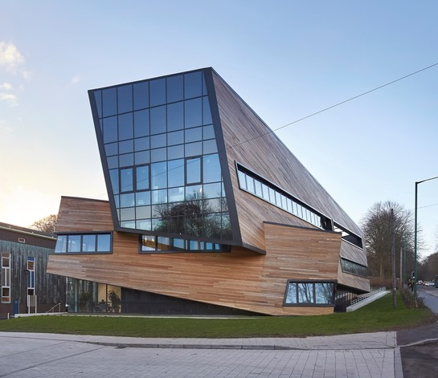

# Data Federation Workshop

18-19th May 2026

*Location:* Institute for Computational Cosmology, Durham University
 - Room OCW017, Ogden Centre West building, South Road, DH1 3LE
 - [Google maps location](https://www.google.com/maps/place/54%C2%B046'01.8%22N+1%C2%B034'29.4%22W/@54.76718,-1.5797085,17z)

Investigation of large scale data movement and a Globus-focused session.

The afternoon of 18th will focus on the Globus suite of tools, including configuration, installation and usage, and overview of features.

The morning of 19th will focus on user-driven large scale data transfer.

We welcome talks on this topic - please provide details in the [registration form]().

This workshop is funded by the Data Federation project which is part of [NFCS+](https://nfcs-networkplus.ac.uk/).

## Registration

Please [register here]()

## Agenda

Monday 18th

- 12:30 Arrival and lunch
- 13:30 Globus workshop
  - Including features, installation and configuration
- 15:00 Refreshment break
- 15:30 Globus compute, flows, data streaming
  - A more indepth look at the Globus family of tools
- 17:00 Close
- 19:00 Dinner

Tuesday 19th

- 09:00 Arrival and refreshments
- 09:30 Data sharing workshop
- 11:00 Refreshments
- 11:30 Data sharing workshop
- 13:00 Lunch
- 14:00 End of workshop

